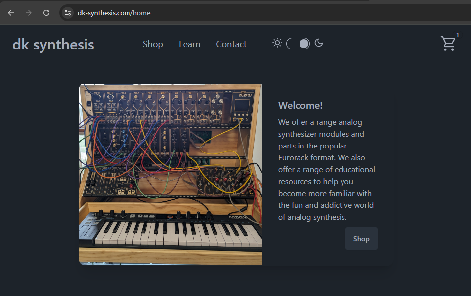

# DK Synthesis

## Description

DK-synthesis.com is an e-commerce site for a small business building and selling analog synthesizer modules, created with Angular and NodeJS. Users can browse the shop, add purchases to their cart and checkout with a secure embedded Stripe payment. They can also learn more about analog synthesis through the education resources provided. The app is compatible and responsive to both desktop and mobile use.

## Live Demo

- ### [DK Synthesis](https://dk-synthesis.com)

## Technology Stack and Tools used
- [Angular](https://angular.dev/)
- [NodeJS](https://nodejs.org)
- [Express](https://expressjs.com/)
- [MongoDB](https://www.mongodb.com/)
- [Google Firebase](https://firebase.google.com/)
- [Fly.io](https://fly.io/)
- [TailwindCSS](https://tailwindcss.com/)
- [DaisyUI](https://daisyui.com/)
- [Cloudinary](https://cloudinary.com/)
- [Nodemailer](https://nodemailer.com/)

## Future updates
- Add authentication so returning customers can login and save preferences
- Add more educational content

 